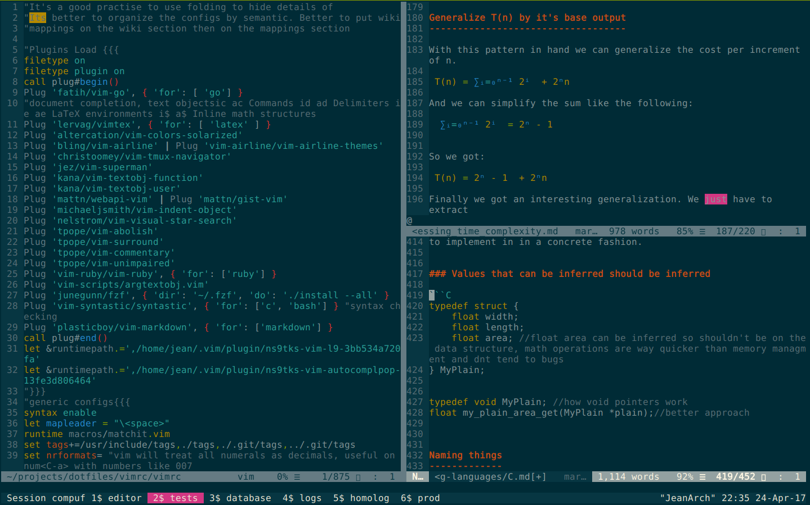

vimrc
=====

My awesome vim :).


Features
--------

Optimized for:
 - Software development
 - Markdown editing
 - Latex editing

Beyond a text editor my vim serves as well as:
 - wiki
 - journal/diary
 - task manager + calendar
 - manual viewer (vman)
 - pager (like less)

Installation
------------

Simmply move this directory to your home.
```
mv vim ~/.vim
```


